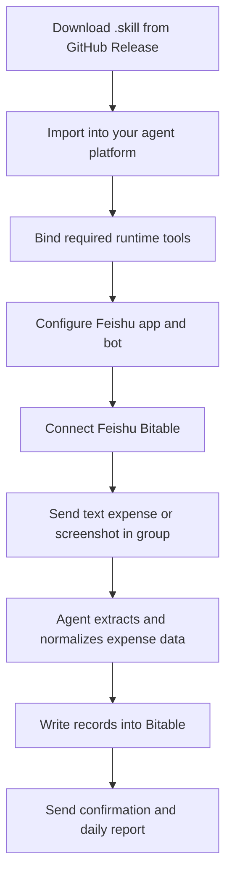

# Travel Expense Tracker Skill

[](https://github.com/MarxMa95/travel-expense-tracker-skill)
[](https://github.com/MarxMa95/travel-expense-tracker-skill/releases)
[](./LICENSE)
[](https://github.com/MarxMa95/travel-expense-tracker-skill/releases)

An open-source travel expense tracking skill for OpenClaw-like agents running in Feishu groups.

This is a skill package repository, not a standalone Python service.

它是一个面向 Agent 的 Skill，不是完整的服务端应用，也不是一个需要单独部署的 Python 后端。仓库里的 Python 文件只是随 Skill 一起分发的辅助脚本，用来做标准化、拆分和格式化。只要宿主 Agent 具备飞书消息接入、HTTP、图片理解、定时任务和少量 KV 存储能力，就可以把这个 Skill 接进去，在飞书群里实现：

- 消费截图识别并自动记账
- 文字记账
- 住宿费用按晚拆分
- 飞书多维表格存储
- 每日日报推送
- 旅行项目状态自动更新

## Quick Start

If you just want to try this skill with your own agent, use this path:

1. Open the latest GitHub Release and download `travel-expense-tracker.skill`
2. Import that `.skill` file into your agent platform
3. Make sure your agent runtime provides the required tools in `skill/references/tool_contracts.md`
4. Configure your Feishu app credentials, bot access, and Bitable permissions
5. Start using prompts like "记一笔旅行消费" or send a payment screenshot in your Feishu group

## How to Import This `.skill` Into Your Agent

The exact UI differs by platform, but the usual flow is:

1. Go to your agent platform's skill or extension import page
2. Choose **Import from file** or an equivalent option
3. Upload `travel-expense-tracker.skill` from the latest release
4. Confirm the imported skill metadata and enable it for your target agent
5. Map the required runtime tools if your platform asks for tool bindings
6. Add your Feishu configuration and test with a sample message or screenshot

If your platform does not support `.skill` import directly, clone this repository and wire the files under `skill/` into your own runtime manually.

## Usage Flow



## Features

- Screenshot-to-expense workflow for travel receipts and payment screenshots
- Structured text expense entry from natural-language messages
- Accommodation splitting by stay nights
- Feishu Bitable-backed storage model
- Daily digest generation for active trips
- Agent-oriented tool contracts and runtime assumptions

## Who This Is For

This repository is for people who already have an agent runtime and want to add a reusable travel-expense-tracking skill on top of it.

Typical host environments include:

- OpenClaw-like agents
- Feishu bot agents with tool calling
- LLM agents with HTTP + vision + scheduling capabilities

## What’s Inside

This repository separates GitHub-facing project files from the runtime skill package:

```text
.
├── README.md
├── LICENSE
├── .gitignore
├── examples/
├── scripts/
│   └── package_skill.sh
└── skill/
    ├── SKILL.md
    ├── agents/openai.yaml
    ├── references/
    └── scripts/
```

- `skill/SKILL.md`: the main agent contract and workflow definition
- `skill/references/`: schema, API guidance, business rules, and tool contracts
- `skill/scripts/`: reusable helper scripts for normalization, splitting, and reporting
- `scripts/package_skill.sh`: packages the runtime files into a `.skill` archive

## How to Use

There are two common ways to use this repository.

### Option 1: Use the packaged `.skill` file

Choose this if you already have an agent platform that can import or install skill packages.

1. Go to the latest GitHub Release
2. Download `travel-expense-tracker.skill`
3. Import that file into your agent platform
4. Make sure your host agent provides the required tools listed in `skill/references/tool_contracts.md`
5. Configure your Feishu app credentials and Bitable access

This is the easiest path for normal users.

### Option 2: Clone the repository and customize it

Choose this if you want to adapt the skill to your own agent runtime, tools, or Feishu integration layer.

1. Clone this repository
2. Start from `skill/SKILL.md`
3. Map your runtime tools to the contracts in `skill/references/tool_contracts.md`
4. Review schema and API expectations in `skill/references/schema.md` and `skill/references/api_guide.md`
5. Re-package the skill with `bash scripts/package_skill.sh` after your changes

### Why there is Python in the repository

This often causes confusion, so here is the short version:

- `skill/SKILL.md` is the main skill definition
- `skill/references/` contains supporting docs the agent reads when needed
- `skill/scripts/*.py` contains helper utilities bundled with the skill

Those Python files are not a standalone service. They are small deterministic helpers for things like:

- normalizing extracted expense JSON
- splitting accommodation cost by night
- formatting daily report text

## Runtime Requirements

Your host agent should provide at least these capabilities:

- `http_request`
- `download_file`
- `vision_extract`
- `schedule_job`
- `send_group_message`
- `kv_get` / `kv_set`

See `skill/references/tool_contracts.md` for the exact contract.

## Feishu Requirements

You need:

- a Feishu app with `app_id` and `app_secret`
- a bot identity that can send group messages
- permission to read and write Feishu Bitable
- a target chat/group where the skill will run

## Local Examples

Normalize raw vision output:

```bash
python3 skill/scripts/recognize_expense.py examples/sample_expense_raw.json
```

Split accommodation costs:

```bash
python3 skill/scripts/split_accommodation.py 1500 2026-04-20 2026-04-23
```

Render a daily report:

```bash
python3 skill/scripts/format_report.py "$(cat examples/sample_report.json)"
```

## Package the Skill

```bash
bash scripts/package_skill.sh
```

This creates:

```text
dist/travel-expense-tracker.skill
```

## Open Source Notes

Before publishing, make sure:

- no real tokens, secrets, webhook URLs, chat IDs, or user IDs are committed
- all examples are sanitized
- production environment config stays outside the repository
- the host agent maps the tool contracts in `skill/references/tool_contracts.md`

## Non-Official Project

This is a community-maintained project and is not an official Feishu product.
